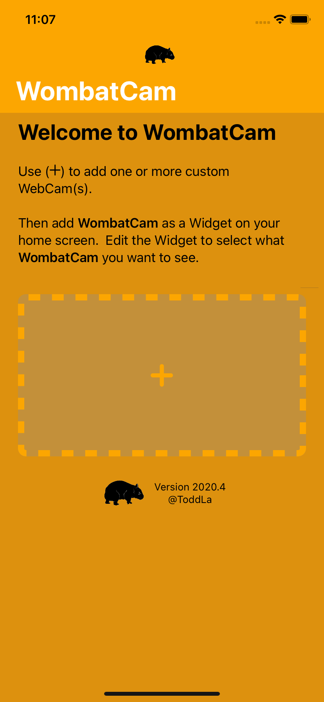
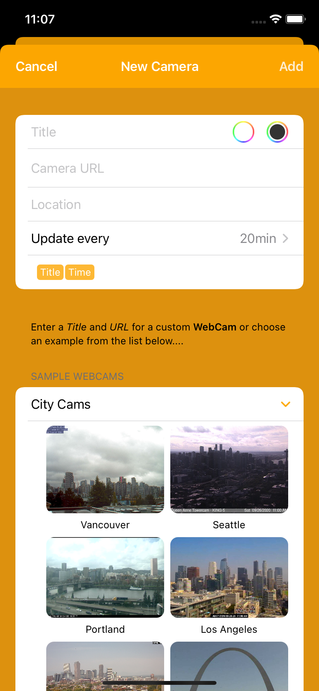

# **WombatCam** Help

## How to add a **WebCam** to your home screen with **WombatCam**

1.  Run **WombatCam** on iOS 14 or later.
2.  Tap the `+` button
3.  Enter a *Title* and *URL* for a custom **WebCam**, or select an example **WebCam**
4.  Tap the `Add` button
5.  return to the iPhone/iPad home screen.
6.  long press on your wall paper to enter "jiggle" mode.
7.  Tap the ` + ` button in the upper left.
8.  Select **WombatCam**
9.  Choose a Widget size, and Tap `Add Widget`
10. Tap `Done` to leave "jiggle" mode.
11. Long press on the **WombatCam** Widget to change what **WebCam** is displayed.

  <video src="WombatCamFirstTime.m4v" style="min-width:300px;width:30%" autoplay loop>
  
## Support and Feedback
[@ToddLa](https://twitter.com/ToddLa)  
[mail](mailto:ToddLa+WombatCam@HotMail.com)  
